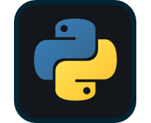

(assets/python.png)]

## 👋 Hi, I’m Mehrdad

---

  <strong>
    A Data Scientist with 5+ years of experience using data, statistics, and experimentation to support real-world business and product decisions across telecom and healthcare.
      
    I enjoy turning complex datasets into actionable insights using SQL, Python, and Statistical Analysis, with a strong focus on A/B testing, Causal Thinking, and Metric Design.
      
    I’ve worked on cloud-based analytics and data science solutions across Microsoft Azure and Google Cloud, building scalable data models, pipelines, and applied ML systems for prediction and decision support.
      
    My work emphasizes Practical and Responsible Machine Learning — prioritizing interpretability, evaluation, and real-world impact over buzzwords.
  </strong>

🎥 Video Walk-through of Projects on [YouTube](https://www.youtube.com/@Mehrdad_Dehghan)

💬 My official page on LinkedIn [LinkedIn](https://www.linkedin.com/in/mehrdad-dehghan/)

--- 

#### Languages and Tools:

